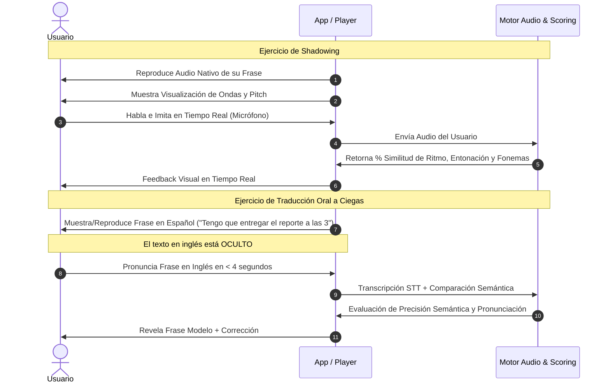

# Documento 01: Módulos y Especificaciones Funcionales

Este documento desglosa la arquitectura funcional, los módulos del sistema, los requerimientos detallados y las reglas de negocio de la aplicación de aprendizaje de inglés basada en el método de **Islas Lingüísticas**.

---

## 1. Módulos Principales del Sistema

```
                                  SISTEMA LINGÜÍSTICO
                                          │
    ┌───────────────────────┬─────────────┴─────────────┬───────────────────────┐
    ▼                       ▼                           ▼                       ▼
[MOD-01] Ingesta &      [MOD-02] Motor de          [MOD-03] Agente IA &     [MOD-04] Perfil,
Islas Lingüísticas     Práctica Activa (SRS)       Fluidez Conversacional   Métricas & Progreso
 - Entrevista Guiada    - Algoritmo FSRS/SM-2       - Chat de Voz Asíncrono  - Mapa de Islas
 - Grabación Abierta    - Módulo Shadowing          - Scoring Fonético       - Retención / Racha
 - Llamada Simulada     - Traducción a Ciegas       - Roleplays Temáticos    - Vocabulario Activo
 - Pipeline NLP/Clust.  - 4 Skills (L/S/R/W)        - Corrección sin Juicio  - Ajustes de voz
```

---

### Módulo 1: Ingesta y Construcción de Islas Lingüísticas (Fase 1)

El propósito de este módulo es extraer el universo lingüístico real del usuario para construir unidades temáticas denominadas **"Islas Lingüísticas"**.

#### 1.1 Métodos de Captura de Información
1. **Entrevista Dinámica Guiada (AI Intake Assistant):**
   - El sistema formula preguntas personalizadas según el perfil del usuario (profesión, familia, pasatiempos, metas, rutinas matutinas y nocturnas).
   - El usuario responde en español mediante notas de voz o texto libre.
   - El asistente realiza contrapreguntas inteligentes para profundizar en frases específicas que el usuario usa con regularidad.

2. **Grabación de Audio en Ambiente Abierto (Passive Life Capture):**
   - Modo de escucha pasiva en el que el usuario activa una sesión de grabación de 15 a 45 minutos durante una conversación real (ejemplo: charla informal con amigos, comida familiar, reunión de trabajo).
   - Procesamiento local de silencios (VAD - *Voice Activity Detection*) para optimizar el envío de datos.
   - Filtro de privacidad y anonimización automática (PII: nombres propios sensibles, números de teléfono, tarjetas, direcciones).

3. **Videollamada / Llamada Simulada (Scenario Roleplay Intake):**
   - Simulación de una llamada telefónica interactiva con un avatar/coach de IA.
   - El bot plantea situaciones del día a día en español para incentivar al usuario a narrar anécdotas, quejarse de situaciones cotidianas o describir sus tareas laborales.

#### 1.2 Pipeline de Procesamiento NLP y Agrupamiento
- **Transcripción y Diarización:** Conversión de voz a texto separando la voz del usuario de la de terceros.
- **Extracción de Entidades y Expresiones Frecuentes:** Extracción de muletillas, verbos habituales, nombres de herramientas de trabajo y modismos personales.
- **Clustering Semántico:** Agrupación de oraciones en **Islas Lingüísticas** (ejemplos: *"Mi trabajo como diseñador UI/UX"*, *"Cocinando con mi pareja los domingos"*, *"Charla con amigos en el bar"*).
- **Traducción Contextualizada y Naturalización:**
  - Traducción al inglés de nivel idiomático natural (no traducción literal palabra por palabra).
  - Generación de variantes de formalidad (informal, neutral, profesional).
  - Almacenamiento de explicaciones gramaticales cortas y enlaces a notas culturales.

---

### Módulo 2: Motor de Aprendizaje y Práctica Activa (Fase 2)

El objetivo de este módulo es transformar el vocabulario pasivo en reflejos orales y auditivos automáticos a través de la producción activa.

#### 2.1 Algoritmo de Repetición Espaciada (SRS)
- Implementación de una variante moderna de **FSRS (Free Spaced Repetition Scheduler)** o **SuperMemo SM-2**.
- Parámetros de retroalimentación por tarjeta/oración:
  - *Otra vez* (Falló totalmente).
  - *Difícil* (Recordó con esfuerzo o error menor de pronunciación).
  - *Bien* (Recordó correctamente en tiempo óptimo).
  - *Fácil* (Automatizado sin vacilación).
- Cálculo automático de intervalos de repaso e índice de estabilidad de memoria.

#### 2.2 Entrenamientos Clave



1. **Re-escucha y Shadowing Fonético:**
   - Reproducción de la frase en inglés con síntesis de voz neuronal de alta expresividad.
   - El usuario escucha y repite simultáneamente o en eco inmediato.
   - Comparación de la forma de onda de audio (*waveform*) y curva de entonación (*pitch curve*) del modelo nativo frente a la del usuario.

2. **Traducción Oral a Ciegas (Blind Oral Translation):**
   - El usuario escucha o lee la frase en español.
   - El texto en inglés permanece oculto.
   - Disparo de temporizador de respuesta rápida (para eliminar la traducción mental lenta).
   - El usuario habla en inglés; el sistema evalúa la precisión semántica y fluidez oral.

3. **Matriz de 4 Destrezas (4 Skills Drills):**
   - **Listening:** Dictado de oraciones personalizadas y reconocimiento de sonidos conectados (*connected speech* / reducciones como *gonna, wanna, could've*).
   - **Speaking:** Grabación y verificación fonética a nivel de palabra clave.
   - **Reading:** Lectura de micro-historias generadas combinando frases de una misma isla.
   - **Writing:** Construcción de oraciones por bloques (ensamblaje sintáctico) y escritura asistida con teclado limitado.

---

### Módulo 3: Agente Conversacional y Fluidez con IA (Fase 3)

Permite poner a prueba las islas de vocabulario en diálogos fluidos mediante interacción por voz sin presión social.

#### 3.1 Chat de Voz Asíncrono y Streaming
- Interfaz estilo mensajería instantánea de notas de voz (tipo WhatsApp/Telegram), eliminando la ansiedad de una videollamada en vivo si el usuario aún no tiene confianza.
- Opción de modo conversación continua en tiempo real (baja latencia con WebSockets / WebRTC).
- Transcripción instantánea opcional (conmutable: ocultar texto para forzar el canal auditivo).

#### 3.2 Motor de Feedback Multidimensional
Por cada intervención oral del usuario, el sistema genera:
- **Puntaje de Pronunciación:** Identificación de fonemas problemáticos específicos para hispanohablantes (ej. `/v/` vs `/b/`, `/ʃ/` vs `/tʃ/`, sonidos vocálicos cortos vs largos).
- **Corrección Gramatical Sutil:** Corrección en positivo ("Dijiste *X*, pero en este contexto suena más natural decir *Y*").
- **Enriquecimiento Idiomático:** Introducción de *phrasal verbs* o colocaciones nativas relacionadas con la isla que se está practicando.

#### 3.3 Modos de Conversación (Roleplay de Contexto Real)
- Escenarios creados automáticamente con base en las islas del usuario:
  - *Entrevista de trabajo técnica para su puesto específico.*
  - *Discusión cotidiana con un compañero de cuarto en Londres.*
  - *Negociación con un cliente en Estados Unidos.*

---

### Módulo 4: Perfil, Gamificación y Analytics

- **Mapa de Islas Lingüísticas:** Visualización interactiva en forma de archipiélago o grafo donde cada isla crece, cambia de color o sube de nivel a medida que sus frases se dominan en el SRS.
- **Termómetro de Retención y Vocabulario Activo:** Contador de palabras/frases activadas (producidas oralmente sin error en los últimos 14 días) vs palabras pasivas.
- **Rachas y Metas Diarias:** Registro de minutos diarios de habla y repeticiones completadas.

---

## 2. Requerimientos Funcionales (RF)

| ID | Nombre | Descripción | Prioridad (MoSCoW) | Criterio de Aceptación |
|---|---|---|---|---|
| **RF-001** | Onboarding y Perfil Inicial | El sistema debe capturar el rol profesional, pasatiempos, nivel percibido de inglés y metas del usuario. | **Must** | El usuario completa un cuestionario interactivo de 4 pasos al registrarse. |
| **RF-002** | Entrevista Asistida por IA | El sistema debe conducir una entrevista guiada por voz/texto para recopilar frases habituales del usuario. | **Must** | El backend procesa las respuestas y genera al menos 15 frases cotidianas candidatas. |
| **RF-003** | Grabación de Audio Abierto | La app debe permitir grabar audio continuo (hasta 30 minutos) con control de pausa, parada y guardado. | **Should** | El audio se comprime en formato AAC/Opus y se sube en fragmentos seguros al backend. |
| **RF-004** | Detección de Silencio (VAD) | La app debe descartar silencios prolongados antes de subir el audio para optimizar transferencia y costos. | **Should** | Silencios mayores a 3 segundos son pausados o descartados del stream de audio. |
| **RF-005** | Llamada Simulada de Ingesta | El usuario debe poder interactuar en una simulación de llamada telefónica guiada por un bot en español. | **Could** | La pantalla simula una interfaz de llamada con retroalimentación acústica del interlocutor. |
| **RF-006** | Generación de Islas Lingüísticas | El backend debe agrupar frases extraídas en clusters semánticos coherentes con nombre y etiqueta. | **Must** | Las frases se clasifican en mínimo 3 islas temáticas automáticas tras la ingesta. |
| **RF-007** | Traducción Contextualizada | Las oraciones extraídas deben traducirse al inglés utilizando un tono natural e idiomático con variantes. | **Must** | Cada frase incluye: inglés nativo, explicación sintética, y pronunciación fonética simplificada. |
| **RF-008** | Edición y Validación de Frases | El usuario puede editar, eliminar o añadir frases personalizadas a sus islas lingüísticas. | **Must** | Las modificaciones en el texto actualizan inmediatamente la traducción y el audio TTS generado. |
| **RF-009** | Síntesis de Voz Neuronal (TTS) | El sistema debe generar audios nativos de alta fidelidad para cada frase en inglés. | **Must** | Latencia de generación < 1.5s; audio nítido a 24kHz en acentos US/UK configurables. |
| **RF-010** | Motor de Repetición Espaciada | Algoritmo que calcula el intervalo de revisión de cada frase según las 4 valoraciones del usuario. | **Must** | Las frases calificadas como "Otra vez" se repiten en la misma sesión; las "Bien/Fácil" incrementan días. |
| **RF-011** | Entrenamiento de Shadowing | Pantalla con reproducción de audio nativo, grabación del usuario y comparador de forma de onda. | **Must** | El usuario puede reproducir el modelo, su propia grabación superpuesta o alternada y ver un score de ritmo. |
| **RF-012** | Traducción Oral a Ciegas | El sistema expone la frase en español con temporizador de 5 segundos; el usuario responde por voz en inglés. | **Must** | El sistema transcribe con STT y valida si el significado coincide al menos en un 80% con el modelo. |
| **RF-013** | Ejercicios 4-Skills | La app generará cuestionarios dinámicos: dictado, completar espacios, ordenar oraciones y selección múltiple. | **Should** | Un set de práctica diario incluye al menos 1 ejercicio de cada destreza. |
| **RF-014** | Chat de Notas de Voz con IA | El usuario envía audios de hasta 60 segundos a un tutor IA en inglés y recibe respuesta en audio y texto. | **Must** | Tiempo de respuesta total (STT + LLM + TTS) menor a 4 segundos. |
| **RF-015** | Evaluación Fonética Detallada | El sistema debe resaltar en colores las palabras mal pronunciadas en el audio del usuario. | **Should** | Palabras en verde (>85%), amarillo (60-84%), rojo (<60%) con sugerencia fonética. |
| **RF-016** | Corrección Gramatical Amigable | El bot de IA señala errores de estructura de forma constructiva sin interrumpir el flujo del diálogo. | **Must** | El mensaje del bot incluye un desplegable colapsable con la "Píldora de Corrección". |
| **RF-017** | Roleplays Temáticos de Isla | El usuario puede iniciar una sesión de conversación basada específicamente en los términos de una isla. | **Should** | El bot conduce la conversación para forzar el uso de al menos 5 frases de la isla elegida. |
| **RF-018** | Visualización Gráfica de Islas | Pantalla con mapa o nodos interactivos que representan el estado de dominio de cada isla. | **Should** | El color y tamaño del nodo refleja el número de frases maduras en el SRS. |
| **RF-019** | Racha y Métricas de Uso | Contador de días consecutivos de práctica y gráfico semanal de oraciones practicadas. | **Must** | Se actualiza automáticamente al completar la meta diaria fijada por el usuario (ej. 10 min/día). |
| **RF-020** | Modo Sin Conexión (Offline Cache) | Las frases y audios programados para la sesión del día deben estar disponibles sin internet. | **Should** | El usuario puede completar sus repasos de SRS offline y sincronizar el progreso al reconectar. |
| **RF-021** | Gestión de Cuenta y Perfil | El usuario puede actualizar sus datos personales, cambiar contraseña y ajustar preferencias de voz. | **Must** | Integrado con el sistema de autenticación JWT existente. |
| **RF-022** | Exportación de Vocabulario | El usuario puede exportar sus islas de frases a formatos abiertos (Anki .apkg, CSV, PDF). | **Could** | Genera un archivo descargable con frases en español, inglés y transcripción fonética. |
| **RF-023** | Configuración de Velocidad de Audio | El reproductor de audio debe soportar velocidades 0.75x, 1.0x y 1.25x sin distorsión de tono (*pitch*). | **Must** | Selector visible en todos los reproductores de la app. |
| **RF-024** | Notificaciones Push de Repaso | Recordatorios locales/push para advertir cuándo las tarjetas de una isla están por vencer en el SRS. | **Should** | Notificación configurable por el usuario a su hora preferida de estudio. |
| **RF-025** | Filtro de Privacidad y Anonimización | Todo audio subido en modo abierto debe anonimizar nombres propios o datos bancarios antes del LLM. | **Must** | Pipeline de preprocesamiento sanitiza transcripciones con reemplazo de tokens `<ANONYMIZED_PII>`. |

---

## 3. Reglas de Negocio (BR)

1. **BR-001 (Propiedad de la Isla):** Una isla de vocabulario pertenece estrictamente a un usuario. Las frases deben mantenerse fieles al estilo coloquial y contexto profesional específico del alumno.
2. **BR-002 (Cálculo de Madurez de Frase):** Una frase se considera "Madura" (*Mastered*) cuando alcanza un intervalo de repaso superior a 21 días consecutivos en el algoritmo SRS sin fallos.
3. **BR-003 (Protección contra Sobrecarga Cognitiva):** No se deben desbloquear más de 10 frases nuevas por isla en un solo día, independientemente del volumen total de frases extraídas durante la ingesta.
4. **BR-004 (Tolerancia en Traducción Oral Ciega):** No se exige coincidencia palabra por palabra con el modelo. Si la expresión del usuario es gramaticalmente correcta y semánticamente equivalente (validado por LLM), se clasifica como acertada.
5. **BR-005 (Privacidad de Grabaciones Pasivas):** Los audios sin procesar de grabación ambiental se eliminan del servidor inmediatamente después de ser transcritos y anonimizados; solo se conserva la transcripción depurada y los fragmentos autorizados expresamente por el usuario.
6. **BR-006 (Filtro Afectivo y Feedback Positivo):** En la Fase 3, el agente de IA nunca utilizará lenguaje punitivo o desalentador. Cada corrección debe ir acompañada de un refuerzo positivo para reducir la ansiedad al hablar.
7. **BR-007 (Cuota de Generación IA):** Las llamadas de síntesis de voz y streaming con LLM están limitadas por cuota diaria según el plan del usuario para salvaguardar costos operativos de API.
