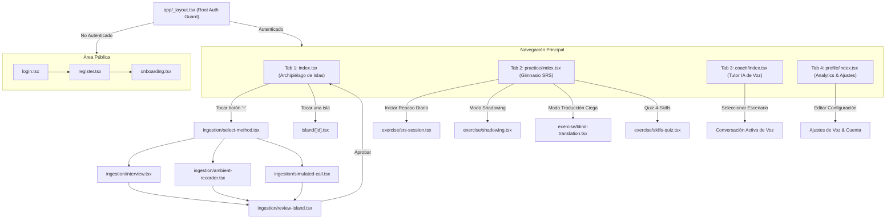
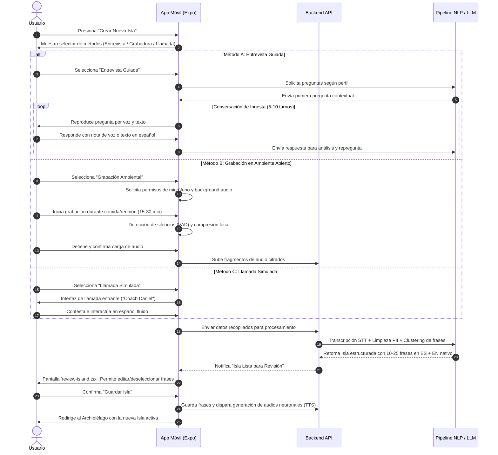
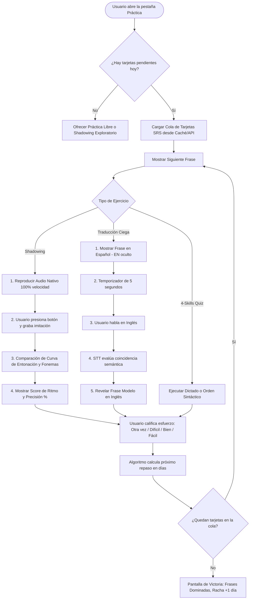
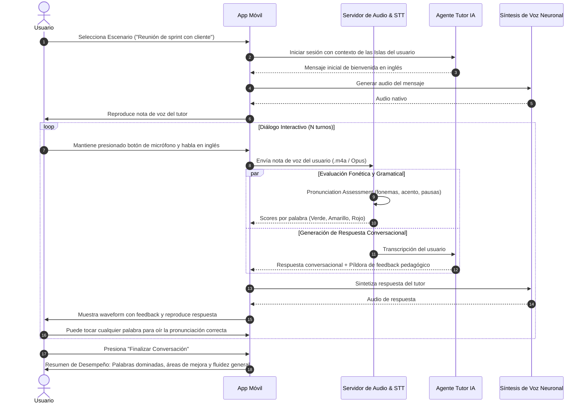

# Documento 02: Flujos de Usuario y Navegabilidad

Este documento define la arquitectura de navegación de la aplicación móvil implementada sobre **Expo Router v6**, los mapas de pantallas y los diagramas de flujo detallados para las tres fases del método de **Islas Lingüísticas**.

---

## 1. Arquitectura de Rutas en Expo Router (`app/`)

El enrutamiento está estructurado siguiendo la convención de carpetas de Expo Router para garantizar un rendimiento óptimo, transiciones fluidas y una clara separación de responsabilidades:

```
app/
├── _layout.tsx                     # Root Layout: Redux Provider, Auth Gate & Tema
├── (auth)/                         # Grupo de autenticación y bienvenida
│   ├── _layout.tsx                 # Stack simple sin cabecera
│   ├── login.tsx                   # Inicio de sesión con JWT
│   ├── register.tsx                # Registro de nuevo usuario
│   └── onboarding.tsx              # Cuestionario inicial (profesión, rutina, metas)
├── (tabs)/                         # Navegación principal en barra inferior (Bottom Tabs)
│   ├── _layout.tsx                 # Configuración de los 4 tabs principales
│   ├── index.tsx                   # TAB 1: Mapa interactivo de Islas Lingüísticas
│   ├── practice/                   # TAB 2: Gimnasio de Práctica Activa (SRS)
│   │   └── index.tsx               # Resumen de repasos diarios y accesos rápidos
│   ├── coach/                      # TAB 3: Asistente Conversacional por Voz
│   │   └── index.tsx               # Chat por notas de voz y selector de roleplays
│   └── profile/                    # TAB 4: Perfil y Estadísticas
│       └── index.tsx               # Métricas de retención, racha y configuración
├── ingestion/                      # Flujos de captura de información (Fase 1)
│   ├── _layout.tsx                 # Stack modal con botón de cierre
│   ├── select-method.tsx           # Selector: Entrevista, Grabación o Llamada
│   ├── interview.tsx               # Entrevista guiada interactiva (Voz/Texto)
│   ├── ambient-recorder.tsx        # Grabación pasiva de ambiente con VAD
│   ├── simulated-call.tsx          # Pantalla de llamada telefónica simulada
│   └── review-island.tsx           # Vista previa, edición y confirmación de frases
├── exercise/                       # Pantallas inmersivas de entrenamiento (Fase 2)
│   ├── _layout.tsx                 # Stack a pantalla completa (sin tab bar)
│   ├── srs-session.tsx             # Sesión de repetición espaciada continua
│   ├── shadowing.tsx               # Pantalla de Shadowing con análisis de onda
│   ├── blind-translation.tsx       # Traducción oral rápida contra reloj
│   └── skills-quiz.tsx             # Cuestionario interactivo (4 skills)
├── island/                         # Detalles de Islas
│   └── [id].tsx                    # Vista detallada de una isla y su catálogo de frases
└── modal.tsx                       # Modal genérico / Notificaciones
```

---

## 2. Mapa de Navegación Visual (Sitemap)



---

## 3. Diagramas de Flujo de Usuario Detallados

### Flujo 1: Captura e Ingesta de Información (Fase 1)

El usuario crea una nueva isla de conocimiento utilizando uno de los tres métodos disponibles:



---

### Flujo 2: Sesión Diaria de Gimnasio Activo (Fase 2)

El estudiante realiza su rutina diaria calculada por el algoritmo de repetición espaciada:



---

### Flujo 3: Fluidez Conversacional con Agente de IA (Fase 3)

El usuario conversa mediante mensajes de voz para automatizar su capacidad de hablar:



---

## 4. Gestión de Estados y Casos Extremos en la App

### 4.1 Manejo de Permisos de Micrófono
- **Detección Previa:** La aplicación verifica permisos antes de entrar a cualquier flujo de grabación mediante `expo-av` o `react-native-permissions`.
- **Estado de Bloqueo:** Si el usuario rechazó el permiso, se muestra una pantalla educativa explicativa con un botón directo a los Ajustes del Sistema Operativo (`Linking.openSettings()`).

### 4.2 Funcionamiento Offline (Sin Conexión)
- **Caché Preventivo de Repasos:** Al abrir la app con conexión, el sistema precarga las tarjetas SRS del día y sus archivos de audio `.mp3` en el almacenamiento local (`FileSystem.documentDirectory`).
- **Registro Local de Intentos:** Si el usuario no tiene conexión durante la sesión de práctica, las calificaciones (Otra vez / Difícil / Bien / Fácil) se encolan en Redux Persist / SQLite local y se sincronizan silenciosamente en segundo plano una vez restaurada la conectividad.

### 4.3 Detección de Ruido de Fondo y Audios Ininteligibles
- Si el módulo de grabación abierta o el ejercicio de habla detecta una relación señal/ruido menor a 12 dB, la interfaz alerta al usuario: *"Demasiado ruido ambiental detectado. Te recomendamos usar auriculares o moverte a un lugar más silencioso"*.
- En caso de que el STT no reconozca ninguna palabra producida, se ofrece la opción de reintentar sin penalizar el puntaje en el SRS.
