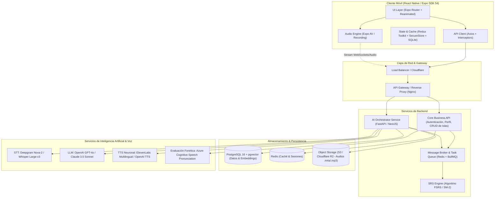
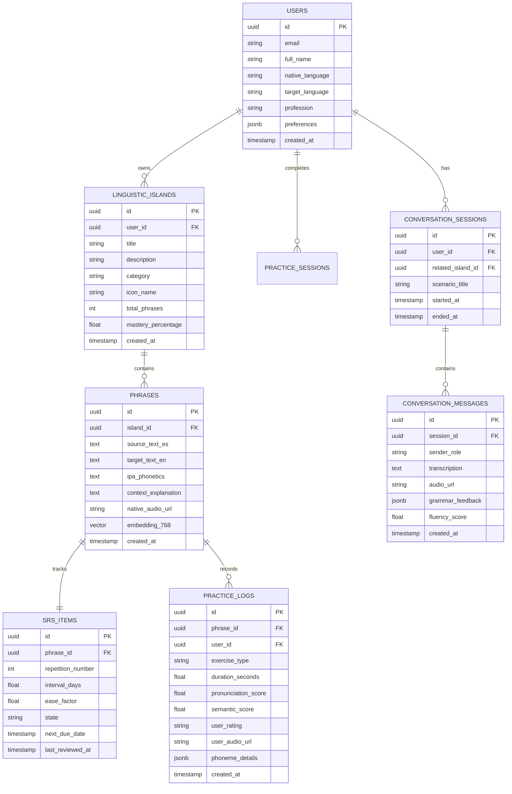

# Documento 03: Arquitectura Técnica y Tecnologías

Este documento detalla la arquitectura de sistemas, la selección de tecnologías, el modelo de datos, los contratos de API y el pipeline de procesamiento de inteligencia artificial y audio para la plataforma de **Islas Lingüísticas**.

---

## 1. Diagrama de Arquitectura del Sistema

La arquitectura sigue un patrón desacoplado orientado a servicios con soporte para procesamiento intensivo de audio en segundo plano y comunicación de baja latencia:



---

## 2. Stack Tecnológico y Justificación

### 2.1 Aplicación Móvil (Frontend)
| Tecnología | Versión | Propósito y Justificación |
|---|---|---|
| **React Native** | 0.81.4 | Rendimiento nativo multiplataforma (iOS y Android) con una base de código unificada. |
| **Expo SDK** | 54.x | Ecosistema maduro de compilación, gestión de permisos nativos y configuración simplificada. |
| **Expo Router** | 6.x | Enrutamiento basado en archivos, carga bajo demanda (*code splitting*) y navegación declarativa robusta. |
| **Redux Toolkit** | 2.9.x | Manejo predecible de estado global (sesión, progreso diario de tarjetas y cola offline). |
| **Expo AV / Native Audio** | ~15.x | Captura de audio en alta fidelidad (AAC/Opus a 16kHz mono) y reproducción con control de velocidad (0.75x a 1.25x). |
| **React Native Reanimated** | 4.x | Animaciones fluidas a 60/120 FPS para el visualizador de forma de onda (*waveforms*) y transiciones de tarjetas. |
| **Expo Secure Store** | 15.x | Almacenamiento cifrado de tokens JWT y claves sensibles en el Keychain/Keystore del dispositivo. |

### 2.2 Backend y Procesamiento Asíncrono
| Componente | Tecnología recomendada | Justificación |
|---|---|---|
| **API Central** | **Node.js / NestJS** o **.NET Core** | Arquitectura modular orientada a dominios. Compatible con los contratos existentes de la plantilla base (`/Auth/Login`, `/User/Create`). |
| **Servicio de IA y Audio** | **Python (FastAPI)** | Soporte nativo para manipulación de señales de audio (FFmpeg, Librosa), integración rápida con SDKs de OpenAI, Azure Speech y tareas de streaming. |
| **Cola de Tareas** | **Redis + BullMQ / Celery** | Procesamiento no bloqueante de audios largos (ingesta de 30 minutos), llamadas en lotes a TTS y actualización periódica del SRS. |
| **Base de Datos** | **PostgreSQL 16 + pgvector** | Almacenamiento relacional de alta confiabilidad con soporte para búsqueda vectorial semántica de frases. |
| **Almacenamiento de Archivos** | **Cloudflare R2 / AWS S3** | Costos óptimos de transferencia para almacenar los audios del usuario y los audios sintéticos de referencia. |

### 2.3 Servicios Especializados de Inteligencia Artificial
| Dominio | Proveedor / Modelo | Casos de Uso en la Plataforma |
|---|---|---|
| **Speech-to-Text (STT)** | **Deepgram Nova-2** / **Whisper Large-v3** | Transcripción de audios ambientales y transcripción en tiempo real de notas de voz en el chat con latencia < 300 ms. |
| **LLM (Razonamiento & Extracción)** | **OpenAI GPT-4o** / **Claude 3.5 Sonnet** | Ingesta de contexto, clustering temático de frases cotidianas, traducción natural contextualizada y coaching conversacional. |
| **Text-to-Speech (TTS)** | **ElevenLabs** / **OpenAI TTS-1-HD** | Generación de voces nativas ultranaturales en acentos estadounidense (US) y británico (UK) para ejercicios de Shadowing. |
| **Evaluación Fonética** | **Azure Speech Pronunciation Assessment** | Puntuación precisa de precisión fonética, fluidez, completitud y prosodia con identificación a nivel de fonema individual. |

---

## 3. Modelo de Datos Relacional y Vectorial (PostgreSQL)



### 3.1 Definición SQL de Tablas Principales

```sql
-- Extensión para búsquedas de similitud semántica
CREATE EXTENSION IF NOT EXISTS "uuid-ossp";
CREATE EXTENSION IF NOT EXISTS vector;

-- Tabla de Islas Lingüísticas
CREATE TABLE linguistic_islands (
    id UUID PRIMARY KEY DEFAULT uuid_generate_v4(),
    user_id UUID NOT NULL REFERENCES users(id) ON DELETE CASCADE,
    title VARCHAR(120) NOT NULL,
    description TEXT,
    category VARCHAR(50) DEFAULT 'general', -- 'work', 'family', 'hobbies', 'daily_routine'
    icon_name VARCHAR(50) DEFAULT 'island',
    mastery_percentage NUMERIC(5,2) DEFAULT 0.00,
    created_at TIMESTAMP WITH TIME ZONE DEFAULT CURRENT_TIMESTAMP
);

-- Tabla de Frases de la Isla
CREATE TABLE phrases (
    id UUID PRIMARY KEY DEFAULT uuid_generate_v4(),
    island_id UUID NOT NULL REFERENCES linguistic_islands(id) ON DELETE CASCADE,
    source_text_es TEXT NOT NULL,
    target_text_en TEXT NOT NULL,
    ipa_phonetics VARCHAR(255),
    context_explanation TEXT,
    native_audio_url VARCHAR(500) NOT NULL,
    embedding VECTOR(1536), -- Vector de OpenAI text-embedding-3-small
    created_at TIMESTAMP WITH TIME ZONE DEFAULT CURRENT_TIMESTAMP
);

-- Tabla de Estado de Repetición Espaciada (SRS / FSRS)
CREATE TABLE srs_items (
    id UUID PRIMARY KEY DEFAULT uuid_generate_v4(),
    phrase_id UUID UNIQUE NOT NULL REFERENCES phrases(id) ON DELETE CASCADE,
    repetition_number INT DEFAULT 0,
    interval_days NUMERIC(7,2) DEFAULT 1.0,
    ease_factor NUMERIC(4,2) DEFAULT 2.50,
    state VARCHAR(20) DEFAULT 'learning', -- 'learning', 'review', 'relearning', 'mastered'
    next_due_date TIMESTAMP WITH TIME ZONE DEFAULT CURRENT_TIMESTAMP,
    last_reviewed_at TIMESTAMP WITH TIME ZONE
);

CREATE INDEX idx_srs_due_date ON srs_items(next_due_date);
CREATE INDEX idx_phrases_island ON phrases(island_id);
```

---

## 4. Contratos de API (Especificación de Endpoints)

### 4.1 Ingesta y Generación de Islas
* **`POST /api/islands/ingest/interview`**
  - **Body:** `{ "turn": 3, "user_audio_base64"?: "...", "user_text_es"?: "..." }`
  - **Respuesta:** `{ "next_question_es": "¿Y qué sueles decirle a tu equipo cuando hay un retraso?", "audio_url": "..." }`

* **`POST /api/islands/generate`**
  - **Body:**
    ```json
    {
      "source_text_corpus": "Texto transcrito de la entrevista o grabación abierta...",
      "island_title": "Coordinación en la Oficina",
      "category": "work"
    }
    ```
  - **Respuesta (201 Created):**
    ```json
    {
      "island_id": "8f3b1234-...",
      "title": "Coordinación en la Oficina",
      "extracted_phrases": [
        {
          "source_text_es": "Tengo que entregar este reporte antes de las tres",
          "target_text_en": "I need to get this report submitted by three o'clock",
          "ipa_phonetics": "aɪ niːd tə ɡɛt ðɪs rɪˈpɔːrt sʌbˈmɪtɪd baɪ θriː əˈklɒk",
          "context_explanation": "Uso coloquial natural en ambientes corporativos (get submitted vs deliver)"
        }
      ]
    }
    ```

### 4.2 Sesión Diaria de Práctica (SRS)
* **`GET /api/practice/daily-queue`**
  - **Retorna:** Lista de frases programadas para hoy, ordenadas por urgencia del algoritmo SRS con sus audios nativos precargados.

* **`POST /api/practice/submit-attempt`**
  - **Form-Data:** `phrase_id`, `exercise_type` (`shadowing` | `blind_translation`), `audio_file` (.m4a), `rating` (`again` | `hard` | `good` | `easy`).
  - **Respuesta:**
    ```json
    {
      "pronunciation_score": 88.5,
      "fluency_score": 82.0,
      "semantic_accuracy": 95.0,
      "phoneme_feedback": [
        { "word": "submitted", "score": 92, "status": "correct" },
        { "word": "three", "score": 64, "status": "warning", "phoneme_issue": "θ" }
      ],
      "srs_update": {
        "next_review_days": 4.5,
        "new_state": "review"
      }
    }
    ```

### 4.3 Tutor Conversacional IA (Streaming / WebSockets)
* **`WS /api/coach/voice-stream`**
  - Conexión full-duplex de audio en tiempo real.
  - El cliente envía paquetes de audio en formato Opus (frames de 20ms).
  - El servidor procesa mediante VAD y Deepgram, consulta al LLM con un prompt especializado de roleplay y transmite el audio generado por ElevenLabs/OpenAI TTS de vuelta al cliente.

---

## 5. Pipeline de Audio y Estrategia de Baja Latencia

```
Micrófono Móvil (16kHz PCM)
        │
        ▼ (Compresión en tiempo real vía Opus/AAC)
Chunk de Audio Ligero (~15KB/s)
        │
        ▼ (Envío inmediato vía WebSocket)
Servidor / Gateway de Audio
   ┌────┴───────────────────────────┐
   ▼                                ▼
Deepgram / Whisper STT         Azure Pronunciation Assessment
(Latencia: ~250ms)             (Latencia: ~400ms)
   │                                │
   ▼                                ▼
Prompt LLM (GPT-4o Streaming)   Análisis Fonético de Palabras
(Primer token: ~300ms)              │
   │                                │
   ▼                                │
Streaming TTS (ElevenLabs/OpenAI)   │
(Primer chunk de audio: ~350ms)     │
   │                                │
   └────────────┬───────────────────┘
                ▼
      Respuesta Integrada
(Audio + Marcadores de Pronunciación en Pantalla)
```

1. **Optimización en el Dispositivo:** Procesamiento previo de ganancia y cancelación de ruido estándar activado a través de los perfiles de audio nativos de iOS (`AVAudioSessionCategoryPlayAndRecord`) y Android (`AudioRecord.VOICE_COMMUNICATION`).
2. **Latencia Percibida Reducida:** En el chat con el tutor de IA, se reproduce un sutil sonido de escucha/confirmación acústica mientras los primeros paquetes de audio sintético se descargan en el búfer local.
