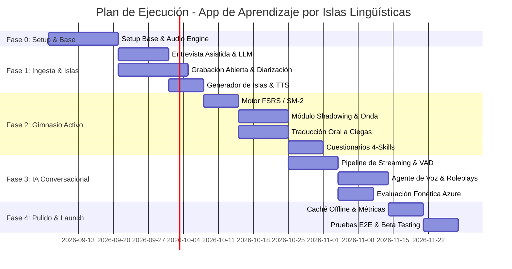

# Documento 04: Plan de Ejecución y Hoja de Registro de Actividades

Este documento establece la ruta de implementación estructurada en fases (Roadmap), el cronograma de ejecución y la **Estructura de Desglose del Trabajo (WBS / Backlog)** con criterios de aceptación y estimación de esfuerzo para la construcción de la aplicación.

---

## 1. Plan de Ejecución por Fases (Roadmap de 13 Semanas)

---

### Descripción de Hitos Clave

* **Hito 0 (Semana 2) - Fundación Tecnológica:**
  - Base móvil operativa sobre Expo SDK 54 con grabación de audio en streaming local probada.
  - Base de datos PostgreSQL configurada con extensión `pgvector` y esquemas iniciales.

* **Hito 1 (Semana 5) - Generador de Islas Funcional (MVP Fase 1):**
  - El usuario puede completar una entrevista guiada o subir un audio de su día cotidiano.
  - El sistema genera su primera **Isla Lingüística** con traducciones naturales y audios nativos sintetizados.

* **Hito 2 (Semana 8) - Gimnasio de Práctica Activa (MVP Fase 2):**
  - Sesiones diarias con algoritmo SRS operativo.
  - Ejercicios de **Shadowing** con comparación visual de ondas y **Traducción Oral a Ciegas** con temporizador.

* **Hito 3 (Semana 11) - Coach de Voz con IA (MVP Fase 3):**
  - Chat interactivo por notas de voz y streaming en inglés.
  - Análisis fonético automático por palabras y sugerencias constructivas de gramática.

* **Hito 4 (Semana 13) - Versión Beta Cerrada (TestFlight / Google Play Beta):**
  - Modo sin conexión con sincronización silenciosa.
  - Gamificación, mapa visual de islas y pruebas de rendimiento superadas.

---

## 2. Hoja de Registro de Actividades / Backlog Detallado (WBS)

### Leyenda de Prioridad y Estimación
* **Prioridad:** P0 (Crítico / Bloqueante), P1 (Alto valor / Esencial), P2 (Deseable / Complementario).
* **Estimación:** Puntos de Historia (Story Points - SP) basados en escala Fibonacci (1, 2, 3, 5, 8, 13).

---

### ÉPICA 0: Configuración, Arquitectura y Audio Core
| ID | Tarea / Actividad Técnica | Perfil | Prioridad | Dependencias | SP | Criterio de Aceptación (DoD) |
|---|---|---|---|---|---|---|
| **TSK-001** | Refactorizar navegación base e inicializar tabs | Frontend | P0 | Ninguna | 3 | Expo Router configurado con las 4 pestañas: Islas, Práctica, Coach y Perfil. |
| **TSK-002** | Configurar servicio nativo de grabación y reproducción de audio | Frontend | P0 | TSK-001 | 5 | Módulo con funciones `startRecording()`, `stopRecording()`, `playAudio()` con control de velocidad (0.75x a 1.25x). |
| **TSK-003** | Crear esquema de base de datos PostgreSQL + pgvector | Backend | P0 | Ninguna | 5 | Tablas de usuarios, islas, frases, SRS y logs desplegadas con migraciones automáticas. |
| **TSK-004** | Configurar bucket S3 / Cloudflare R2 y endpoints de subida segura | DevOps/Backend | P0 | TSK-003 | 3 | Carga de archivos de audio mediante URLs firmadas de corta duración. |

---

### ÉPICA 1: Ingesta de Información y Construcción de Islas (Fase 1)
| ID | Tarea / Actividad Técnica | Perfil | Prioridad | Dependencias | SP | Criterio de Aceptación (DoD) |
|---|---|---|---|---|---|---|
| **TSK-101** | UI del Onboarding inicial (profesión, rutinas, metas) | Frontend | P1 | TSK-001 | 3 | Formulario de 4 pasos con validaciones y persistencia en el perfil de usuario. |
| **TSK-102** | Pantalla y flujo de Entrevista Guiada por IA | Frontend | P0 | TSK-002 | 5 | Interfaz de chat dinámico con audio y texto; permite enviar notas de voz en español. |
| **TSK-103** | Pantalla de Grabación Abierta con VAD y temporizador | Frontend | P1 | TSK-002 | 5 | Grabadora continua con gráfica de volumen en tiempo real y detección local de silencios. |
| **TSK-104** | Pantalla de Llamada Simulada de Ingesta | Frontend | P2 | TSK-002 | 5 | Interfaz tipo llamada entrante/en curso con audio bidireccional fluido. |
| **TSK-105** | Pipeline NLP: Transcripción, Sanitización PII y Diarización | Backend/AI | P0 | TSK-004 | 8 | Endpoint que procesa audio, elimina datos personales sensibles y extrae texto limpio. |
| **TSK-106** | Pipeline LLM: Clustering temático y traducción contextual | Backend/AI | P0 | TSK-105 | 8 | Genera clusters de oraciones cotidianas en español con su traducción idiomática en inglés. |
| **TSK-107** | Pipeline de generación masiva de audios nativos (TTS) | Backend/AI | P0 | TSK-106 | 5 | Genera audios `.mp3` de alta fidelidad vía ElevenLabs/OpenAI TTS y los asocia a las frases. |
| **TSK-108** | Pantalla de Revisión, Edición y Aprobación de la Isla | Frontend | P0 | TSK-106 | 5 | Permite al usuario desmarcar frases irrelevantes, editar el texto y confirmar la creación. |

---

### ÉPICA 2: Gimnasio Lingüístico y Práctica Activa (Fase 2)
| ID | Tarea / Actividad Técnica | Perfil | Prioridad | Dependencias | SP | Criterio de Aceptación (DoD) |
|---|---|---|---|---|---|---|
| **TSK-201** | Implementación del motor de Repetición Espaciada (FSRS/SM-2) | Backend | P0 | TSK-003 | 5 | Algoritmo que calcula `next_due_date` según las 4 calificaciones (Again, Hard, Good, Easy). |
| **TSK-202** | Endpoint `GET /api/practice/daily-queue` | Backend | P0 | TSK-201 | 3 | Retorna la lista de tarjetas vencidas para el día con sus URLs de audio cacheadas. |
| **TSK-203** | Pantalla de Shadowing con visualizador de onda interactivo | Frontend | P0 | TSK-002 | 8 | El usuario escucha el modelo, graba su voz y visualiza la comparación de onda y ritmo. |
| **TSK-204** | Pantalla de Traducción Oral a Ciegas contra reloj | Frontend | P0 | TSK-002 | 5 | Muestra la frase en español con cuenta regresiva de 5s; el usuario responde por voz en inglés. |
| **TSK-205** | Endpoint de evaluación semántica de traducción oral | Backend/AI | P0 | TSK-204 | 5 | Valida mediante STT y embeddings si la producción oral coincide con el significado esperado. |
| **TSK-206** | Componente de Micro-Cuestionarios 4-Skills (Listening/Writing) | Frontend | P1 | TSK-202 | 5 | Ejercicios de dictado de audio y ordenamiento de oraciones por bloques arrastrables. |
| **TSK-207** | Pantalla de resumen y victoria de la sesión diaria | Frontend | P1 | TSK-203 | 3 | Muestra frases dominadas, puntaje de pronunciación promedio y actualización de racha. |

---

### ÉPICA 3: Agente Conversacional y Fluidez IA (Fase 3)
| ID | Tarea / Actividad Técnica | Perfil | Prioridad | Dependencias | SP | Criterio de Aceptación (DoD) |
|---|---|---|---|---|---|---|
| **TSK-301** | Interfaz de Chat de Voz Asíncrono (Estilo notas de voz) | Frontend | P0 | TSK-002 | 5 | Permite grabar, enviar y reproducir audios con indicador de estado (enviando, transcribiendo, respondiendo). |
| **TSK-302** | Integración del Agente LLM contextualizado con las Islas | Backend/AI | P0 | TSK-106 | 8 | El agente adopta un rol empático y dirige la conversación hacia el uso de las frases del usuario. |
| **TSK-303** | Integración de Azure Speech Pronunciation Assessment | Backend/AI | P0 | TSK-004 | 8 | Retorna métricas detalladas a nivel de palabra: precisión fonética, fluidez y prosodia. |
| **TSK-304** | Visualización de feedback fonético interactivo en la app | Frontend | P0 | TSK-303 | 5 | Palabras coloreadas (verde/amarillo/rojo); al tocar una palabra se escucha su sonido modelo. |
| **TSK-305** | Módulo de "Píldora Gramatical Constructiva" | Frontend/AI | P1 | TSK-302 | 3 | Desplegable debajo de cada mensaje del bot con sugerencias amables de mejora en inglés. |
| **TSK-306** | Modo Streaming de voz en tiempo real con WebSockets | Fullstack | P2 | TSK-301 | 13 | Conversación de voz continua con latencia global < 1.2 segundos. |

---

### ÉPICA 4: Gamificación, Modo Offline y Despliegue (Fase 4)
| ID | Tarea / Actividad Técnica | Perfil | Prioridad | Dependencias | SP | Criterio de Aceptación (DoD) |
|---|---|---|---|---|---|---|
| **TSK-401** | Mapa interactivo de Islas Lingüísticas (Archipiélago) | Frontend | P1 | TSK-001 | 5 | Nodos gráficos interactivos que muestran el porcentaje de dominio y nivel de cada isla. |
| **TSK-402** | Caché local de tarjetas y sincronización en segundo plano | Frontend | P1 | TSK-202 | 8 | Permite practicar sin internet; sincroniza resultados automáticamente al reconectar. |
| **TSK-403** | Sistema de racha diaria y notificaciones push programadas | Fullstack | P1 | TSK-201 | 5 | Notificación push recordatoria personalizada cuando el usuario está en riesgo de perder su racha. |
| **TSK-404** | Suite de pruebas unitarias y de integración en mobile y API | QA/Dev | P0 | TSK-203 | 8 | Cobertura de tests en flujos de login, SRS y llamadas a los pipelines de audio. |
| **TSK-405** | Configuración de pipelines CI/CD y compilación con EAS Build | DevOps | P0 | TSK-404 | 5 | Generación automatizada de binarios `.ipa` (iOS) y `.aab` (Android) para distribución interna. |

---

## 3. Matriz de Riesgos Técnicos y Estrategias de Mitigación

| Riesgo Técnico | Severidad | Probabilidad | Estrategia de Mitigación |
|---|---|---|---|
| **Altos costos operativos por consumo de APIs de IA (TTS / LLM)** | Alta | Media | Implementar caché estricto de audios TTS en Cloudflare R2 (no sintetizar dos veces la misma frase); limitar cuotas diarias de conversación en el tier gratuito; utilizar modelos optimizados como Whisper/Deepgram y GPT-4o-mini para tareas secundarias. |
| **Latencia excesiva en respuestas de audio en redes 3G/4G** | Alta | Alta | Compresión local eficiente con Opus a 16kbps; uso de WebSockets en lugar de polling HTTP; envío anticipado de audio en chunks (*chunked transfer*); reproducción de audio en streaming sin esperar el archivo completo. |
| **Problemas de privacidad con la grabación en ambiente abierto** | Crítica | Baja | Filtrado estricto de datos de identificación personal (PII) antes de persistir o enviar texto a modelos externos; destrucción inmediata del archivo de audio original tras la transcripción; advertencias explícitas de consentimiento informado en la app. |
| **Falsos rechazos en la evaluación fonética en hispanohablantes** | Media | Alta | Calibrar umbrales de severidad en el analizador fonético; priorizar la inteligibilidad global sobre el acento nativo perfecto para no frustrar al estudiante novato. |
