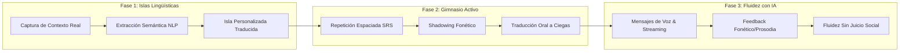

# Especificación y Arquitectura del Sistema: Aplicación de Aprendizaje de Inglés por Islas Lingüísticas

Este repositorio contiene la especificación completa, arquitectura técnica, modelado funcional, diagramas de flujo y plan de ejecución para la plataforma móvil de aprendizaje acelerado de inglés basada en el **Método de Tres Fases e Islas Lingüísticas**.

---

## 🎯 Filosofía del Producto: El Método de Tres Fases

Aprender un idioma a menudo fracasa porque los métodos tradicionales enseñan vocabulario abstracto o descontextualizado ("la manzana es roja", "el gato está sobre la mesa"). Nuestro enfoque cambia radicalmente la premisa: **el estudiante aprende primero a expresar su propia vida**.

### 1. Fase 1: Construcción de la "Isla Lingüística" (Vocabulario Propio)
* **Objetivo:** Registrar el ecosistema verbal cotidiano del usuario (su profesión, gustos, familia, expresiones muletilla, rutinas y jerga de trabajo).
* **Mecanismos de Ingesta:**
  - Entrevistas guiadas y dinámicas conducidas por el sistema.
  - Grabación pasiva/abierta de conversaciones reales de su día a día (con consentimiento y filtros de privacidad).
  - Videollamadas o llamadas de voz simuladas con escenarios cotidianos.
* **Resultado:** Un grafo de conocimiento personalizado traducido al inglés natural, contextualizado por hablantes nativos mediante IA.

### 2. Fase 2: Gimnasio Lingüístico & Práctica Activa (Las 4 Destrezas)
* **Objetivo:** Fijar el conocimiento en la memoria a largo plazo mediante producción activa, no solo reconocimiento pasivo.
* **Entrenamientos clave:**
  - **Repetición Espaciada (SRS):** Algoritmo inteligente (FSRS o SM-2) que programa repasos justo antes de la curva del olvido.
  - **Re-escucha y Shadowing:** Escuchar la propia frase producida por voz nativa neuronal y grabarse intentando replicar la entonación, ritmo y fonética exacta (comparador de onda y prosodia).
  - **Traducción Oral a Ciegas (Prompt inverso):** El sistema muestra o dice la frase en español y el usuario debe pronunciarla en inglés sin ver el texto en pantalla.
  - **Entrenamiento 4-Skills:** Listening, Speaking, Reading y Writing integrados en micro-cuestionarios.

### 3. Fase 3: Fluidez Conversacional y Refinamiento con IA
* **Objetivo:** Transferir las islas de conocimiento a conversaciones dinámicas e improvisadas en un entorno seguro y sin ansiedad social.
* **Mecanismos:**
  - Envío de notas de voz bidireccionales con un Coach de IA paciente y adaptativo.
  - Feedback inmediato y multidimensional: puntuación de fonética, detección de errores gramaticales, sugerencias de expresiones más idiomáticas.
  - Roleplay enfocado en las islas del usuario (ej: simulación de una reunión de trabajo o una cena familiar).

---

## 📚 Índice de Documentación Técnica

La documentación del proyecto está estructurada en los siguientes módulos detallados:

1. [**01. Módulos y Especificaciones Funcionales**](./01_modulos_y_especificaciones_funcionales.md)
   - Descripción detallada de los subsistemas funcionales.
   - Especificación de requerimientos funcionales (RF-001 al RF-025) y criterios de aceptación.
   - Reglas de negocio y lógica de procesamiento de lenguaje.

2. [**02. Flujos de Usuario y Navegabilidad**](./02_flujos_y_navegabilidad.md)
   - Mapeo completo de pantallas adaptado a **Expo Router** (`app/`).
   - Diagramas de flujo de usuario (Mermaid) para Ingesta, Entrenamiento y Práctica con IA.
   - Wireflows de interacción, estados vacíos y manejo offline.

3. [**03. Arquitectura Técnica y Tecnologías**](./03_arquitectura_tecnica_y_tecnologias.md)
   - Stack tecnológico completo (Frontend Móvil, Backend, Modelos de IA STT/TTS/LLM).
   - Diagramas de arquitectura del sistema e integración de servicios.
   - Modelo de base de datos relacional y vectorial (PostgreSQL + pgvector).
   - Contratos de API (REST y WebSockets) y pipelines de procesamiento de audio.

4. [**04. Plan de Ejecución y Hoja de Registro de Actividades**](./04_plan_de_ejecucion_y_hoja_de_actividades.md)
   - Roadmap de desarrollo estructurado en 5 fases/hitos.
   - Estructura de Desglose del Trabajo (WBS / Backlog) con estimación de esfuerzo en Story Points.
   - Matriz de riesgos técnicos y planes de contingencia.

---

## 🚀 Estado de la Base de Código Existente

La aplicación móvil toma como base el repositorio actual [**LineaBaseNaimad-Mobile**](../), el cual ya provee:
- **Expo SDK 54** con **React Native 0.81** y **TypeScript**.
- Enrutamiento por archivos con **Expo Router v6** (`app/(auth)` y `app/(tabs)`).
- Gestión de estado global con **Redux Toolkit** (`src/state`).
- Cliente HTTP **Axios** con interceptores y refresco transparente de tokens JWT (`src/api`).
- Almacenamiento seguro nativo con **`expo-secure-store`** (`src/utils/storage.ts`).
